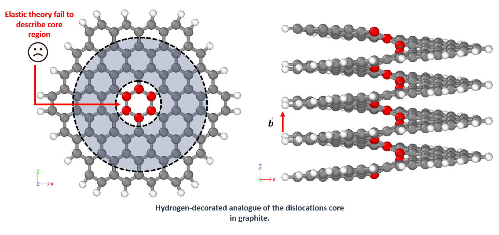
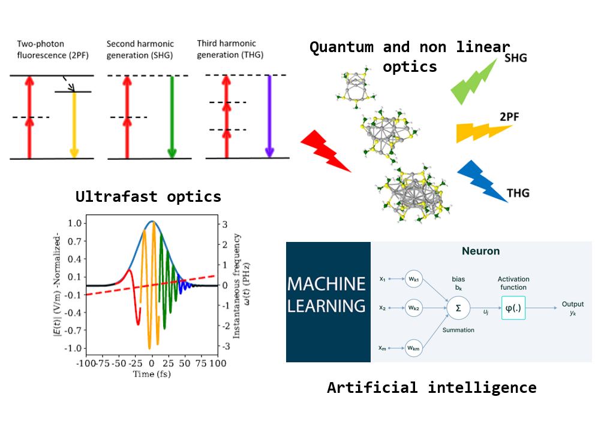
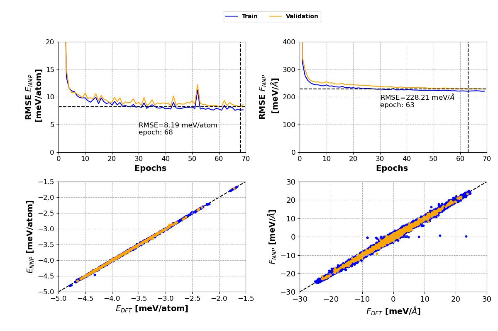
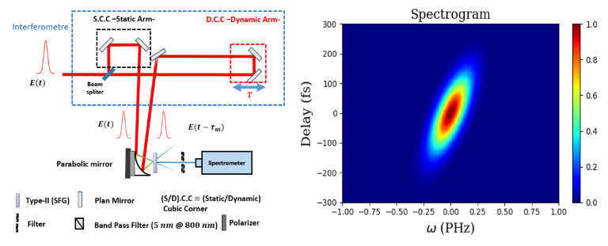
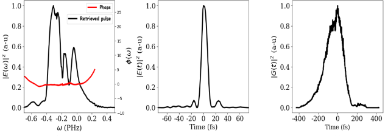
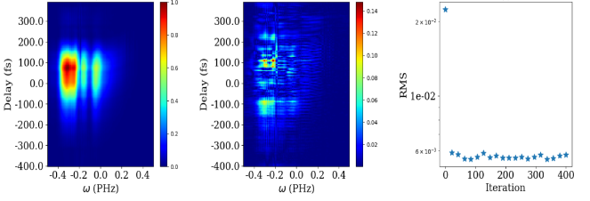
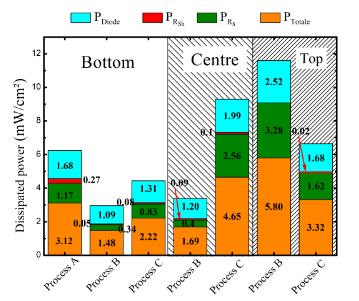
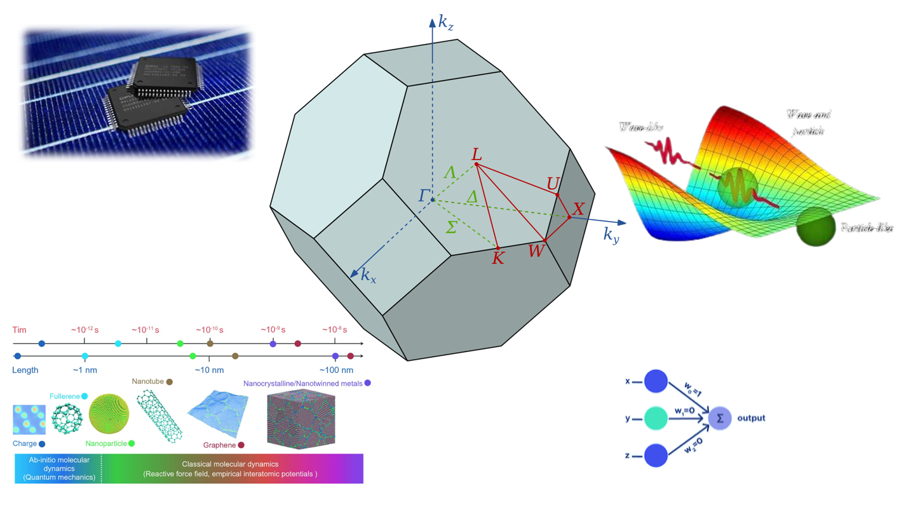

<table>
<td>

# Anouar Akacha DELENDA

### PhD student

[Institut des Matériaux de Nantes Jean Rouxe, Nantes, France](https://www.cnrs-imn.fr/)

[Physique des Matériaux et Nanostructures (PMN)](https://www.cnrs-imn.fr/index.php/recherche-equipes-et-travaux/physique-des-materiaux-et-nanostructures-equipe-pmn.html)

## PhD Thesis

<table>
<td>

**Dislocations in layered carbon nanomaterials**\
🏛️[Institut des Matériaux de Nantes Jean Rouxe, Nantes, France](https://www.cnrs-imn.fr/)([🗺️](https://www.google.co.uk/maps/place/Jean+Rouxel+Institute+of+Materials+in+Nantes/@47.2355369,-1.5576231,17z/data=!3m1!4b1!4m6!3m5!1s0x4805ee814c9f2ae9:0x41adc40e0ddc8801!8m2!3d47.2355369!4d-1.5550482!16s%2Fg%2F1wk7q75w?entry=tts&g_ep=EgoyMDI1MDgxMy4wIPu8ASoASAFQAw%3D%3D&skid=d2b3abc3-7fe1-4a51-81dc-e27ed03ab93e))

</td>
<td>

**November 2024 - Present**

</td>
</table>

<b>More details</b>

  
  In materials engineering, defects such as dislocations (e.g. screws and edges) are of
  fundamental importance.
  The control of these defects has the potential to drive significant advancements in the field of
  materials science.
  However, these defects are not yet fully understood, especially in the case of anisotropic
  materials. My research focuses
  on understanding the behaviour of these defects and their impact on layered materials such as
  graphite. To this end:

<ul>
  <li>I am focusing on dislocations defects (initially screws) and their impact on layered
    materials (primarily graphite).</li>
  <li>I use both Gaussian (<a href="http://aimpro.ncl.ac.uk/">AIMPRO</a>) and Plan-wave (<a
      href="https://www.vasp.at/">VASP</a>) DFT-based code</li>
  <li>I perform large scale molecular dynamics simulations (<a
      href="https://www.lammps.org/#gsc.tab=0">LAMMPS</a>) using machine learning interatomic
    potential.</li>
</ul>

 

## 🎓 Academic Background

<table>
<td>

**M.Sc : Physics of Optics and Photonics (Lyon, France)**\
🏛️ [Université de Claude Bernard Lyon 1. Villeurbane, France](https://www.univ-lyon1.fr/) ([🗺️](https://www.google.fr/maps/place/Claude+Bernard+University+Lyon+1/@45.7795871,4.8274937,14z/data=!4m7!3m6!1s0x47f4ea143dd86f25:0x7bfebbdcecc615b7!8m2!3d45.7795871!4d4.8656025!15sCiBDbGF1ZGUgQmVybmFyZCBVbml2ZXJzaXR5IEx5b24gMSIDiAEBkgEKdW5pdmVyc2l0eaoBYwoNL2cvMTFoMTV4eGt0MQoJL20vMGQzdF96EAEyHxABIhv7z6abhuJ1DQHNAmvnCoesiCeSBp38RxzFj0AyJBACIiBjbGF1ZGUgYmVybmFyZCB1bml2ZXJzaXR5IGx5b24gMeABAA!16zL20vMGQzdF96?entry=tts&g_ep=EgoyMDI1MDgxMy4wIPu8ASoASAFQAw%3D%3D&skid=b0656bf5-9521-4de4-9f3f-318c21d0cc6a))

</td>
<td>

**From September 2023 to June 2024**

</td>
</table>

<b>More details</b>

  

          
          The Master at the university of Claude Bernard Lyon 1, is a new track launched recently (~2022).
          The program
          is mostly dedicated to Optics and Photonics (<a
            href="https://offre-de-formations.univ-lyon1.fr/parcours-1540/m2-optique-et-photonique-opho.html">OPHO</a>).
          The program offers various courses mainly:
        <ul>
          <li>Quantum and non-linear optics: Quantification of the Electromagnetic fields, Light nature
            and Photons statistics, Non-linear Optics process (SFG, SHG, THG ...) etc.</li>
          <li>Ultrafast optics: Ultrafast Dynamic, Autocorrelation; Frequency Resolved Optical Gating
            (FROG) and probe-pump measurements, Femtosecond Chirped Pulse Amplification (CPA) etc.</li>
          <li>Artificial intelligence: Supervised Machine Learning (Regression & Classification), Neural
            Network and Convolutional Neural Network ...</li>
        </ul>
        Alongside this, other courses are proposed that I have enrolled for, such as Optics for Nano
        Structures Solids and Imaging Live cells ...
  

<table>
<td>

**M.Sc : Condensed Matter and Nanophysics (Strasbourg, France)**\
🏛️ [Université de Strasbourg, Institut Physique et Chimiques Des Materiaux De Strasbourg (IPCM)](https://www.ipcms.fr/en/home/) ([🗺️](https://www.google.com/maps/place/Institute+Physical+And+Chemistry+Materials+De+Strasbourg/@48.6063232,7.7147126,17z/data=!3m1!4b1!4m6!3m5!1s0x4796b7e1f34d4697:0xea6ddeef1e89a891!8m2!3d48.6063232!4d7.7147126!16s%2Fg%2F1yg6d45_8?entry=tts&g_ep=EgoyMDI1MDgxMy4wIPu8ASoASAFQAw%3D%3D&skid=c8803b40-bebc-4abe-bf13-a4f2e05927e0))

</td>
<td>

**From September 2022 to June 2023**

</td>
</table>

<b>More details</b>

    
    The Master has been renamed as <a
      href="https://physique-ingenierie.unistra.fr/formations/masters/physique/physics-of-quantum-and-soft-condensed-matter-phyqs/">"Physics
      of quantum and soft condensed matter (PhyQS)"</a>. The program is highly diverse
    and unique. The lectures cover materials' electronic structure, optical, magnetic properties,
    and their applications on the nanometer scale, while tracking recent advancements in the fields
    of nanophysics.
    The program has three main pillars hovering around solid-state physics:
  <ul>
    <li>Advanced Quantum Mechanics: Quantum theory of diffusion; Landauer-Büttiker approach for the
      conductance of coherent systems; Kubo formalism and linear response theory for quantum
      electronic transport; graphene...</li>
    <li>Advanced Statistical Physics: Non-equilibrium statistical physics and transport phenomena:
      Brownian motion (concept of “coarse-graining”); Markov processes (Fokker-Planck and Langevin
      equations...); linear response theory (fluctuation-dissipation theorem & Kramers-Kronig
      relation).</li>
    <li>Light and Matter Interaction: Linear response of a material medium to an electromagnetic
      excitation; semi-classical approximations and optically induced transitions between
      electronic states of matter (Franck–Condon) ...</li>
  </ul>
  In addition, I enrolled for additional lectures within the attended program: Theory and
  Computational Modeling of the Electronic Structure of Materials; Low Dimensional Nanostructures and
  Biophysics ...

<table>
<td>

**B.Sc and M.Sc : Materials Physics (Algiers, Algeria)**\
🏛️ [ University of Science and Technology - Houari Boumediene (USTHB), Algiers, Algeria ](https://www.usthb.dz) ([🗺️](https://www.google.co.uk/maps/place/University+Of+Science+And+Technology+Houari+Boumediene/@36.7130857,3.1767088,17z/data=!3m1!4b1!4m6!3m5!1s0x128e5189eb619c9d:0x787a0b4fa45e227a!8m2!3d36.7130857!4d3.1792837!16s%2Fm%2F0cr4g_m?entry=tts&g_ep=EgoyMDI1MDgxMy4wIPu8ASoASAFQAw%3D%3D&skid=8373d95f-2837-436c-9a3f-74ccafee10d7))

</td>
<td>

**From 2019 to 2021 (Bachelors + Graduate/Master)**
</td>
</table>

<b>More details</b>

  Here marks the beginning of my journey. After three years of studying fundamental physics, I
  decided to pursue a master's degree in Materials Physics. During this phase, I acquired a robust
  foundation in solid-state physics. Furthermore, the track I selected was focused on
  Semiconductors and Dielectric Materials.
  The program aimed to prepare future materials science researchers, encompassing both
  experimental and theoretical aspects. The master's program offered a range of lectures, and I
  will highlight a few of them:
<ul>
  <li>Physics of Condensed Matters</li>
  <li>Elastic Waves in Fluids and Solids</li>
  <li>Dielectric and Magnetic Properties of Materials</li>
  <li>Advanced Optics and Laser Physics</li>
  <li>Transport Phenomena in Semiconductors</li>
  <li>Materials Characterization</li>
</ul>

 

##  💼📊 Academic experience

The following is a list of all the conferences & workshops I attended (<a href="../../pages/confsWorkshops.html">Read
  more</a>). In addition to all my previous conducted internships.

 

##  A. Conferences

<table>
<td>

- <a href='https://premc.org/carbon2025/'>The Carbon conference 2025, Saint-Malo, France</a> ([🗺️](https://www.google.fr/maps/place/Saint-Malo/@48.6462995,-2.0071128,12z/data=!3m1!4b1!4m6!3m5!1s0x480e81102126bf5d:0xf8e97dadb22be12d!8m2!3d48.649221!4d-2.0184218!16zL20vMDFiejc1?entry=tts&g_ep=EgoyMDI1MDgxMy4wIPu8ASoASAFQAw%3D%3D&skid=824198be-5bd3-4d0e-8fe3-ef99b311c414))
- <a>The NanoteC24 conference, Nantes, France</a>([🗺️](https://www.google.co.uk/maps/place/Jean+Rouxel+Institute+of+Materials+in+Nantes/@47.2355369,-1.5576231,17z/data=!3m1!4b1!4m6!3m5!1s0x4805ee814c9f2ae9:0x41adc40e0ddc8801!8m2!3d47.2355369!4d-1.5550482!16s%2Fg%2F1wk7q75w?entry=tts&g_ep=EgoyMDI1MDgxMy4wIPu8ASoASAFQAw%3D%3D&skid=d2b3abc3-7fe1-4a51-81dc-e27ed03ab93e))
- <a >THE FIRST INTERNATIONAL CONFERENCE ON RENEWABLE ENERGY ADVANCED TECHNOLOGIES AND APPLICATIONS (ICREATA'21), Adrar, Algeria</a> ([🗺️](<https://www.google.com/maps/place/Unit%C3%A9+de+recherche+en+%C3%A9nergies+renouvelables+Adrar(URER-MS)/@27.8797396,-0.2735652,17z/data=!3m1!4b1!4m6!3m5!1s0xdf59fa7a6fce385:0x1caa1b0e13504169!8m2!3d27.8797396!4d-0.2735652!16s%2Fg%2F11bw4tlh8p?entry=tts&g_ep=EgoyMDI1MDgxMy4wIPu8ASoASAFQAw%3D%3D&skid=f96879b1-0c05-4a28-bd81-caf0c1bd6d79>))

</td>
<td>

- June 29th → July 4th 2025
- 27th → 30th August 2024
- 25th → 27th October 2021
</td>
</table>

## B. Workshops

<table>
<td>

- <a href='https://www.pyroman.cnrs.fr/pyroman/workshop-2025'>The Pyroman workshop (PNRB), Rennes, France</a> ([🗺️](https://www.google.co.uk/maps/place/University+of+Rennes+-+Campus+Beaulieu/@48.1174917,-1.6382906,17z/data=!3m1!4b1!4m6!3m5!1s0x480edee5d13d72cd:0x570f619868b57bc!8m2!3d48.1174917!4d-1.6382906!16s%2Fg%2F120htj5b?entry=tts&g_ep=EgoyMDI1MDgxMy4wIPu8ASoASAFQAw%3D%3D&skid=87910e51-67f6-4dbd-9fce-2d16344289cd))
- [Exploring chemical reactions in VASP (Online 🌐)](https://events.zoom.us/ev/AsOkINVi2NtwNsvyfYHK0gZRmankuRHP6zBv9o1ZLC5XuDRMBsr_~As7YYDeWv85Zj0fyPCowzxsM1QvfY4NVYDE4-Db5WA5Ldtn6LeYojtIEjg)
</td>
<td>

- 28th → 29th June 2025
- 06th −→ 08th November 2024
</td>
</table>

 

##  C. Internships

**February 2024 → July 2024 (Master2)**

Identification of borophene allotropes from STM images by Machine Learning: from the development of a neural network interatomic potential to building the image classification tool.

🧪🔬🖥️ [Institut de Lumière Matère (ILM)](https://ilm.univ-lyon1.fr/index.php?option=com_content&view=article&id=2&act=2&lang=2), team: [Theoretical Physical Chemistry](https://ilm.univ-lyon1.fr/index.php?option=com_content&view=article&id=65)

🧪🔬🖥️ [Laboratory des Matériaux et Interfaces (LMI)](https://lmi.cnrs.fr/), team: [Matériaux à Basse Dimensionnalité (MBD)](https://lmi.cnrs.fr/teams/mbd/)

🗺️ [VILLEURBANNE, FRANCE.](https://www.google.com/maps/place/Claude+Bernard+University+Lyon+1/@45.7795871,4.8656025,17z/data=!3m1!4b1!4m6!3m5!1s0x47f4ea143dd86f25:0x7bfebbdcecc615b7!8m2!3d45.7795871!4d4.8656025!16zL20vMGQzdF96?entry=tts&g_ep=EgoyMDI1MDgxMy4wIPu8ASoASAFQAw%3D%3D&skid=71661947-35bc-453d-bdc9-bb7d278e5af7)

📑 [Thesis](https://drive.google.com/drive/folders/1eje_7bchp9bDV8zf-0suwVL_cDtNplxx)

<b>More details</b>

Borophene is a 2D material that has honeycomb structures similar to graphene. Borophene exists
in various structures called allotropes. Furthermore, to characterize such materials, a Scanning
Tunneling Microscope (STM) is generally used. However, the process is not straightforward and
involves comparing experimental data to theoretically simulated images generated from Density
Functional Theory (DFT). Although DFT is accurate, it is time-consuming. The intended purpose is
to utilize an existing Neural Network Potential (NNP) to create a database of structures and
simulated STM images for training and testing a classification neural network.

<table>
<td style="padding: 10px; vertical-align: top;">

Borophene Allotropes

</td>
<td style="padding: 10px; vertical-align: top;">

High dimensional neural network architecture

</td>
<td style="padding: 10px; vertical-align: top;">

Energies & Forces-normes validations

</td>
</table>

 

**February 2023 → June 2023 (Master2)**

Characterization Of Ultrashort Laser Pulse Centred at 800 nm

🧪🔬🖥️ [Institut de physique et chimie des Matériaux de Strasbourg (IPCMS)](https://www.ipcms.fr/en/home/), department: [Ultrafast Optics and Nanophotonics (DON)](https://www.ipcms.fr/en/departement/departments/ultrafast-optics-and-nanophotonics-don/)
🗺️ [Strasbourg, FRANCE.](https://www.google.com/maps/place/Institute+Physical+And+Chemistry+Materials+De+Strasbourg/@48.6063232,7.7147126,17z/data=!3m1!4b1!4m6!3m5!1s0x4796b7e1f34d4697:0xea6ddeef1e89a891!8m2!3d48.6063232!4d7.7147126!16s%2Fg%2F1yg6d45_8?entry=tts&g_ep=EgoyMDI1MDgxMy4wIPu8ASoASAFQAw%3D%3D&skid=5f45cabc-bb1b-4c94-9a5e-46e54108e2d3)
📑 [Thesis](https://drive.google.com/drive/folders/1Am22JyUt7h6sZwXIvwmRLrIaW3sHZ9KE)

<b>More details</b>

In order to study the kinetics of molecules and probe their optical properties, we employ
spectroscopy, which enables us to perform transient absorption and observe the signatures of
rapid photo-reactions (e.g., carbon-carbon double bond isomerization) occurring on picosecond or
sub-picosecond timescales. However, achieving this requires a well-characterized laser pulse,
which means full access to temporal and spectral profiles. Unfortunately, electronic measurement
does not accommodate the rapid oscillation of the electric field (few cycles). Here, we call for
indirect optical characterization, such as using Frequency Resolved Optical Gating (FROG). For
this work, we deployed Time Domain Ptychography techniques to solve a reconstruction problem, in
particular, spectral phase retrieval. I implemented the Time Domain Ptychography algorithm to
characterize the ultrashort pulses.

<table>
<td style="padding: 10px; vertical-align: top;">

Frequency Resolved Optical Gating (FROG)

</td>
<td style="padding: 10px; vertical-align: top;">

Retrievement of the pulse profile/phase.

</td>
<td style="padding: 10px; vertical-align: top;">

The retrieved 2D FROG map difference between measured & reconstructed spectra.

</td>
</table>

 

**March 2021 → June 2021 (Master2)**

Power Loss Analysis On Based Silicon Solar cells

🧪🔬🖥️ [Research Center for Semiconductor Technology and Energetics (CRTSE)](https://crtse.dz/) Division: [Semiconductor Conversion Device Development](https://crtse.dz/division-ddcs/)

🗺️ [Algiers, Algeria.](https://www.google.com/maps/place/Semiconductor+Technology+Research+Center+for+Energetics/@36.7794136,3.052815,17z/data=!3m1!4b1!4m6!3m5!1s0x128fb2577446f121:0xb80ae3aeaa2febba!8m2!3d36.7794136!4d3.052815!16s%2Fg%2F11c1q44xkp?entry=tts&g_ep=EgoyMDI1MDgxMy4wIPu8ASoASAFQAw%3D%3D&skid=367e76e2-d55e-491c-8f23-69ed5a95d65d)

📑 [Absract](https://drive.google.com/file/d/1DtDWEwj_NtLMR2OPVi2hcx94zJQgc4LD/view)

<b>More details</b>

In order to study the kinetics of molecules and probe their optical properties, we employ
spectroscopy, which enables us to perform transient absorption and observe the signatures of
rapid photo-reactions (e.g., carbon-carbon double bond isomerization) occurring on picosecond or
sub-picosecond timescales. However, achieving this requires a well-characterized laser pulse,
which means full access to temporal and spectral profiles. Unfortunately, electronic measurement
does not accommodate the rapid oscillation of the electric field (few cycles). Here, we call for
indirect optical characterization, such as using Frequency Resolved Optical Gating (FROG). For
this work, we deployed Time Domain Ptychography techniques to solve a reconstruction problem, in
particular, spectral phase retrieval. I implemented the Time Domain Ptychography algorithm to
characterize the ultrashort pulses.

<table style="width: 100%; text-align: center; border-collapse: collapse;">
  <tr>
    <td style="padding: 10px; vertical-align: top;">
      
      

        Manufactured m-Si solar cell (before screen printing)
      

    </td>
    <td style="padding: 10px; vertical-align: top;">
      
      

        Manufactured m-Si solar cell (after screen printing) with Al leads (contacts)
      

    </td>
    <td style="padding: 10px; vertical-align: top;">
      
      

        Dissipated Power in the shunt, the series resistance and in the forward bias diode.
      

    </td>
    <td style="padding: 10px; vertical-align: top;">
      
      

        Current Analysis of losses due to reflection and parasitic absorption.
      

    </td>
  </tr>
</table>

 

# ⛳ Area of Interests

  
  Basically I like to work in any field related to the following areas:

- Solid State Physics & Nano-Materials Devices (2D Materials).
- Atomistic modeling.
- Photonics.
- Semiconductors & Opto-electronics Devices.
- Artificial Intelligence: Machine Learning.

 

# Skills & Projects

## 🎯 Skills

**Programming Language**

    .
    ├── 🐍 Python/
    └── >_ Bash/

**📈 Data Analysiss**

    .
    ├── pandas/
    ├── numpy/
    ├── scipy/
    │
    ├── matplotlib/
    └── seaborn/

**🤖 Machine Learning**

    .
    ├── scikit-learn/
    ├── Regression & Classification/
    ├── Neural Network & Convolutional NN/
    └── Related Topics/
        ├── High Dimensional Neural Network Potential (HDNNP)
        └── Atomic Cluster Expansion (ACE)/

**🔋Materials characterization techniques**

    .
    ├── Solar Simulator/
    ├── Spectral Response/
    └── Suns-Voc/

**🔦Ultrafast Laser characterization**

    .
    └── Ultrafast Characterization Techniques/
        ├── Interferometric Auto-correlation/
        ├── Frequency Resolved Optical Gating (FROG)/
        └── Time Domain Ptychography (TDP)/

**⚛Atomistic Simulation**

    .
    └── Simulation Software/
        ├── Vienna Ab initio Simulation Package (VASP)/
        ├── Ab Initio Modelling PROgram (AIMPRO)/
        ├── Large-scale Atomic/Molecular Massively Parallel Simulator (LAMMPS)/
        └── Atomic Simulation Environment (ASE)/

##  👩🏻‍💻 Projects

  
  The following is a list of side projects (<a href="./projects.html">Read more</a>):

- [Model Selection for Atomization EnergyPrediction](https://www.kaggle.com/code/delendaanouarakacha/model-selection-for-atomization-energy-prediction)
- [Ultrafast Ptychography](https://github.com/anouarDELENDA/Ultrafast-Ptycho)
- [Linear tetrahedron method for electronicdensity calculations](https://github.com/anouarDELENDA/Density_Of_State_LTM)
- [LearnPlatform COVID-19 Impact on Digital Learning](https://www.kaggle.com/code/delendaanouarakacha/learnplatform-covid-19-impact-on-digital-learning)

</td>

<td style="width: 30%; position: relative;">
  

<b>🦘 to OR <a href="../../assets/documents/resume_cv.pdf">⬇️📄 my CV</a></b>

- [Top page](#toppage)
- [Academic background](#background)
  - [Lyon, France](#lyon)
  - [Strasboourg, France](#stras)
  - [Algiers, Algeria](#algiers)
- [Academic Experience](#experience)
  - [Conferences](#confs)
  - [Workshops](#workshops)
  - [Internships](#internships)
- [Area of interest](#interest)
- [Skills & Projects](#competences)
  - [Skills](#skills)
  - [Projects](#projects)
  

  

  </td>
  </table>
