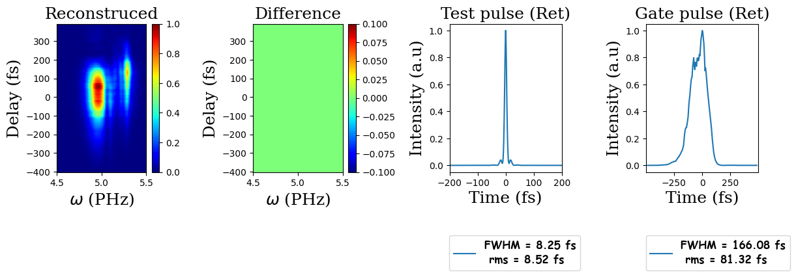
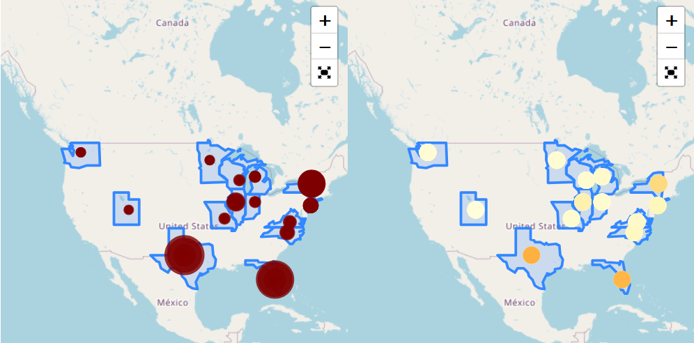

> ## <a href="https://www.kaggle.com/code/delendaanouarakacha/model-selection-for-atomization-energy-prediction">Model Selection for Atomization Energy Prediction</a>
> 

> 
> 
 In this work, I aim to span a various Machine Learning models; especially the regression ones. And the goal is to select the most promissing model that can predict in a smart fashion the Atomization energy of a given molecular structure. The Data can be found in the DataBase called GDB−13, also it is available under the name <code>roboBohr</code> as <code>csv</code> file format in kaggle's Dataset <code>energy-molecule</code> <a href="https://www.kaggle.com/code/delendaanouarakacha/model-selection-for-atomization-energy-prediction">Read more...</a>

> 
<b>Tags</b>: Machine Learning, Atomization energy, energy-molecule, Singular Value Decomposition, features engineering, Hyperparamaters.

> 

> ## <a href="">Ultrafast Ptychography</a>
> 

> 
> 
 The <b>Ptychography</b> is a microscopy tool to investigate the crystal structure, this idea started in the lately sixties (1969) by Walter Hoppe. And by the growth of the computational power it start to gain more attention in 1982. The main concept addressed by this method is to reconstruct a crystal structure. Emerging the Ptychography into spectroscopy can be done by changing the problem from spatial-reciprocal space representation to time-frequency description. <a href="">Read more...</a>

> 
<b>Tags</b>: Ultrafast, Optical Pulse, Characterization, Spectral phase.

> 

> ## <a href="">Linear tetrahedron method for electronic density calculations</a>
> 

> 
> 
 The aim of this work is to explain in a decent way the most used method to evaluate electronic structure proprieties of any compounds. Mainly within the frame work of this topic we targeted the semiconductors (Si and Ge) and Carbon for the sake of diversity. The latter method is refers to Tight Binding approach. Furthermore, We introduced the theoretical formalism in more simplified way, where we focus to break down the complexity of the problem. We were also interested to evaluate the Density of state using the Linear Tetrahedron Method. <a href="">Read more...</a>

> 
<b>Tags</b>: Electronic Structure, semiconductors, Tight Binding, Density of state, Linear Tetrahedron Method.

> 

> ## <a href="https://www.kaggle.com/code/delendaanouarakacha/learnplatform-covid-19-impact-on-digital-learning">LearnPlatform COVID-19 Impact on Digital Learning</a>
> 

> 
> 
 This was a Data Analysis challenge in Kaggle platform, during the the COVID pendamic. Where the challenge was to explore (1) the state of digital learning in 2020 and (2) how the engagement of digital learning relates to factors such as district demographics, broadband access, and state/national level policies and events. .  <b><a href="https://www.kaggle.com/competitions/learnplatform-covid19-impact-on-digital-learning">Problem Statement:</a></b> The COVID-19 Pandemic has disrupted learning for more than 56 million students in the United States. In the Spring of 2020, <a href="https://www.kaggle.com/code/delendaanouarakacha/learnplatform-covid-19-impact-on-digital-learning">Read more...</a>

> 
<b>Tags</b>: COVID, Data Analysis, Education, Digital Learning, Engagement, Clickbait.

> 

