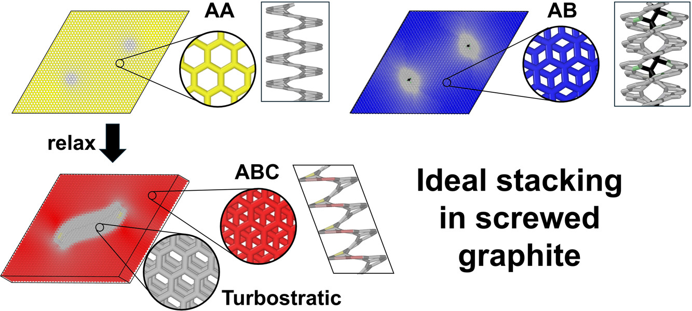
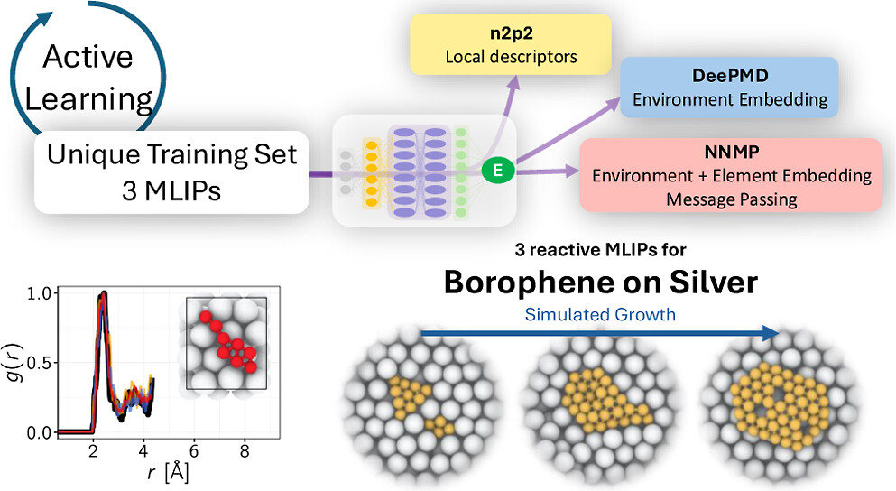

<h1 align="left"> List of publications</h1> 
 

> <h2 align="center"> Influence of screw dislocations on stacking order in graphite</h2> 

> <b>Gabriel R. Francas1, Anouar-Akacha Delenda2, Jacob W. Martin1, Colin Bousige3, Irene Suarez-Martinez1, Nigel A. Marks1, Chris Ewels2 
> 
>
> <b>1</b> Dept. of Physics and Astronomy, Curtin University, Perth, Australia 
> <b>2</b> Nantes Université, CNRS, Institut des Matériaux de Nantes Jean Rouxel, IMN, Nantes, F-44000, France 
> <b>3</b> Universite Claude Bernard Lyon 1, CNRS, LMI UMR 5615, Villeurbanne F-69100, France 
>  
> Carbon Journal Volume 247, February 2026, 120995 
>  
> 
> <h3 align="left"> Abstract</h3> 
> 
>

>In this study, we examine the impact of the density of non-basal screw dislocations on the stacking order of graphite using machine learning interatomic potentials (MLIP). Furthermore, according to the latest developments in MLIP, we benchmarked the Gaussian approximation potential (GAP20) and the atomic cluster expansion (ACE-D2) against first-principles calculations using density functional theory (DFT), as well as other empirical force fields. Moreover, a new approach to identifying the local stacking registration is presented. The paper demonstrates that double screw dislocations in graphite favour the Bernal stacking (AB) configuration, whereas single screw defects prefer the rombohedral configuration (ABC). Additionally, Simulation outcomes demonstrate that, above a certain density, the graphite becomes buckled turbostratic.

> 
> 

# 

> <h2 align="center">  A Portable Data Set for Borophene Growth Modeling with Reactive Neural Network Potentials</h2> 
>
> Colin Bousige1, Anouar-Akacha Delenda2, Abdul-Rahman Allouche2, and Pierre Mignon2 
> 
>
>1 Universite Claude Bernard Lyon 1, CNRS,
LMI UMR 5615, Villeurbanne F-69100, France.
>**2** Universite Claude Bernard Lyon
1, CNRS, iLM UMR 5306, Villeurbanne F-69100, France. 
>  
>The Journal of Physical Chemistry C 2025 129 (41), 18760-18771  
>  
>  
> <h3 align="left"> Abstract</h3> 
> 
> 
 In this study, we demonstrate that once a representative dataset has been constructed, it can be used to train any machine-learned interatomic potential (MLIP) architecture. This was indeed the case with three different MLIPs: n2p2, DeepMD and NNMP. All the developed models, were validated against First principal calculations using density functional theory (DFT), in terms of energies, forces and reproducibility of various extended allotropes and reactive borophene structures deposited on silver substrate. Additionally, we showcase the possibility to simulate the growth of borophene on a silver substrate.

>
> 

#

