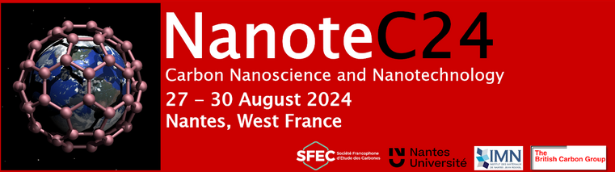

<h1>The NanoteC24 conference</h1>

<b>Location:</b> <a href="https://www.cnrs-imn.fr/">Institut des Matériaux de Nantes Jean Rouxel, Nantes, France</a> <a href="https://maps.app.goo.gl/B16XLTAwk9zCLhxD6">(🗺️)</a> 
<b>Date:</b> 27th → 30th August 2024 
<b>The submitted work:</b> <a href="https://drive.google.com/drive/folders/12XvTUAUEAVIN40VysJe69XhskcELsz4O">Poster</a> 
<b>Proceeding:</b> <a href="https://drive.google.com/file/d/1mCPzYLS_u04KFCPGp4UUwdS46fGbdZSX/view">Explore more in details</a> 
<b>Affiliation:</b> <a href="https://ilm.univ-lyon1.fr/index.php?option=com_content&view=article&id=2&act=2&lang=2">Institut de Lumière Matère (ILM)</a> 
<b>Tags:</b> Conference.
 

> 

> </a>
> 
 The NanoteC is a student friendly international meeting focusing on nanocarbon materials: their production, treatment, properties, in all their monocolour (black) glory! This three days meeting has been running annually,almost continuously since 1998, and in 2024 it took place in Nantes at the Institute of Materials, one of its regular haunts here many previous memorable NanoteCs have taken place.During this conference I participated with a poster titled: <b>Development of a reactive Neural Network Potential for borophene on silver and gold</b>. A fruitful work of the internship conducted at <a href="https://ilm.univ-lyon1.fr/index.php?option=com_content&view=article&id=2&act=2&lang=2">Institut de Lumière Matère (ILM)</a>, <a href="https://ilm.univ-lyon1.fr/index.php?option=com_content&view=article&id=65">Theoretical Physical Chemistry</a></a>  team and <a href="https://lmi.cnrs.fr/"> Laboratory des Matériaux et Interfaces (LMI)</a>, <a href="https://lmi.cnrs.fr/teams/mbd/">Matériaux à Basse Dimensionnalité (MBD)</a> team, during my last master in the University Claude Bernard Lyon 1, France. Villeurbane, France.</li>
</b>
</b>

> 

> </img>
> 

> 

